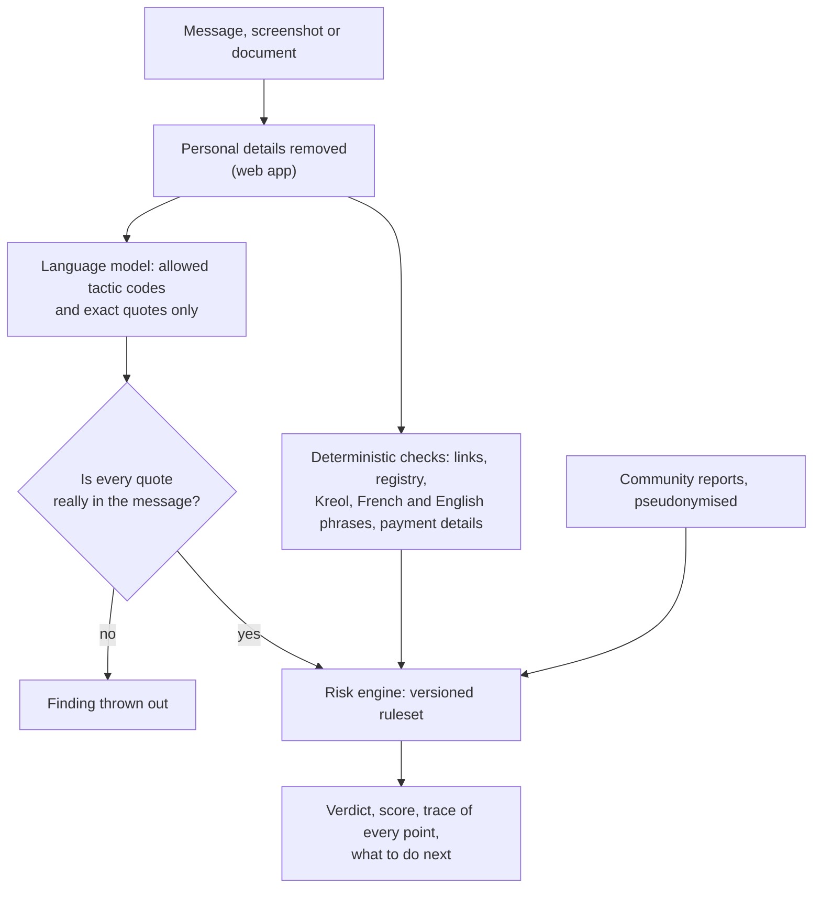
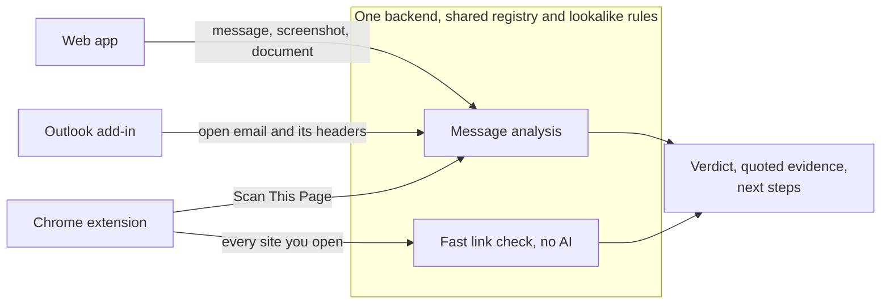
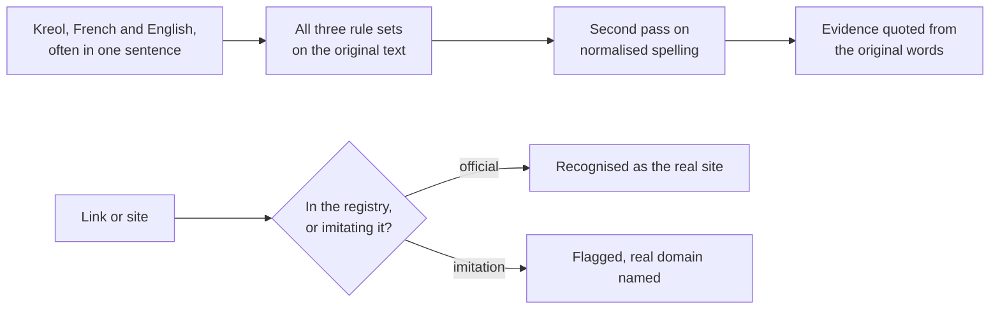
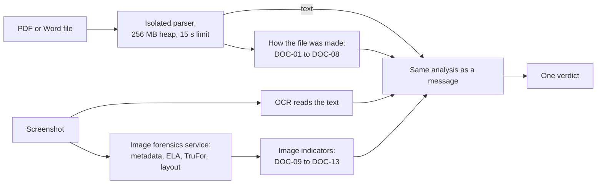

# FraudLens AI

FraudLens checks a suspicious message, link, website, email or document before
you pay, type a password or hand over an OTP. It was built for Mauritius, reads
English, French and Kreol Morisien, and shows the exact words behind every
answer instead of asking you to trust a percentage.

**Try it at [fraudlens.site](https://fraudlens.site)** (the web app is at
[fraudlens.site/app](https://fraudlens.site/app)). Built by Dhruv and Friends
for the Finnovate Web and AI Hackathon 2026.

## What makes it different

- **The AI reads language. Code makes the decision.** A language model spots
  tactics like urgency or an OTP request and must quote the message word for
  word. A versioned rule engine turns the findings into the score, verdict
  and advice, and shows every point it added.
- **It still works when the AI is down.** If the model fails or times out, the
  rules return a full verdict on their own. We designed for a live demo on bad
  Wi-Fi.
- **Kreol comes first.** Kreol rules sit next to the English and French ones,
  understand negation, and handle messages that switch language mid-sentence.
- **It knows the local institutions.** A registry of the official domains of
  MCB, SBM, Absa, Bank One, my.t, Emtel and the MRA catches `mcb-secure.top`,
  `mcb.nu` and `mсb.mu` (with a Cyrillic с) and names the real site.
- **It meets scams where they arrive.** A web app, a Chrome extension and an
  Outlook add-in all call one backend. None of them has its own copy of the
  detection logic.
- **It looks at how a file was made.** It finds a signature pasted onto a scan,
  text typed over a scan, or a PDF edited after signing, and it checks
  screenshots for signs of image editing.
- **Privacy built in.** In the web app, phone numbers, emails and account
  numbers are removed before a message is analysed. A community report keeps a
  fingerprint of the message, never its text.

### How a check works



The rules and the model run at the same time. If the model is unavailable,
its branch adds nothing and the rest of the diagram still produces a verdict.

## The problem

Phishing in Mauritius doesn't look like the phishing most security tools were
trained on. The SMS says your MCB account is blocked, in a mix of Kreol and
French, and links to `mcb-secure.top`. A WhatsApp message from "the bank" asks
for the code it just sent you. A fake MRA refund page asks for your card. An
invoice email to a small business comes from a supplier's domain with one
letter changed, and the bank details have "recently been updated".

Generic scam filters aren't built for this. They don't read Kreol, they don't know
that `mcb.mu` is real and `mcb.nu` isn't, and they grade a message with a score
nobody can explain to their grandmother. So people check a scam the only way
they can, by asking someone they trust, and often only after they have clicked.

## Three ways in, one backend

| Entry point | Where the scam reaches you | What it does |
|---|---|---|
| **Web app** (phone-first PWA) | SMS, WhatsApp, a screenshot, a PDF or Word file | Paste a message, drop a screenshot or upload a document. You get a verdict, the words and links that triggered it, and a short plan. Before You Pay checks a number or IBAN you are about to pay. |
| **Chrome extension** | The website you just opened | Checks every site against the registry, lookalike rules, phishing lists and domain age, and tells you who the site's certificate was issued to. Scan This Page reads the page and its login and card forms. The Security Report grades the site's setup. |
| **Outlook add-in** | An email at work | Looks for business email compromise: a Reply-To that doesn't match the sender, changed bank details, a known supplier writing from a different domain, and CEO requests from personal addresses. |



Every message, from any client, goes through the same function,
`runPipeline()` in
[`backend/src/services/pipeline/index.js`](./backend/src/services/pipeline/index.js).
The extension's per-page check skips the language model on purpose so it is
fast enough to run on every page load, but it uses the same registry and
lookalike rules.

The web app also has a whole-chat Conversation check, Batch scan for up to 50
messages, a Scam Journey view of where a scam is heading next, Fraud Replay,
and a practice sandbox that plays out clearly fictional scams from fixed
playbooks.

## The AI reads, the rules decide

We don't let the language model decide anything. It can return only tactic
codes from a fixed list, each with a quote copied from the message. Our code
then checks every quote against the message and throws out any code that isn't
on the list and any quote that isn't in the text
([`analysis/index.js`](./backend/src/services/analysis/index.js)). A model that
invents evidence therefore can't change the result.

The score comes from a deterministic risk engine with versioned rulesets
([`risk-engine/index.js`](./backend/src/services/risk-engine/index.js), now
`rs-1.6`). Given the same findings, it always gives the same score, and the
trace shows where every point came from. Model findings have a
capped weight, and a strong verdict needs evidence the rules found themselves.
When two checks find the same fact, it scores once and the other check is
listed as support.

Here is real output for a Kreol message, produced by running the pipeline with
the language model switched off:

> MCB: Ou kont pou bloke zordi si ou pa konfirm ou detay. Klik https://mcb-secure.top/verify

| Points | Finding | Quoted from the message |
|---:|---|---|
| 30 | `mcb-secure.top` contains "mcb" but is not an MCB domain. Supported by: the message claims to be MCB but the link isn't `mcb.mu`, and it asks you to "konfirm" through that link. | `https://mcb-secure.top/verify` |
| 10 | Threat of suspension, penalty or legal action | `bloke` |

Result: **40/100, elevated, "verify first"**. The advice is "Do not open the
link in this message" and "Open the organisation's website yourself, or use
its official app".

## Built for Mauritius

**Kreol.** The lexicon has Kreol rules next to the English and French ones, and
all three always run. It understands negation. "Partaz ou OTP ar nou" is a
request for your code and gets flagged. "Pa partaz ou OTP ar personn" is the
bank's own advice and doesn't. "Ou kont pou bloke si ou pa konfirm" reads as the
threat it is. A second pass runs on a copy with normalised spelling (`nu`
becomes `nou`, `pu` becomes `pou`), but the evidence is always quoted from the
words the sender actually wrote.

The language model is given Kreol examples from
[`data/kreol-dataset/`](./data/kreol-dataset/), where every row carries a
review status. Only the 61 rows a person reviewed are used.

**Local domains.** [`data/institution-registry.json`](./data/institution-registry.json)
lists the official domains of seven Mauritian banks, telecoms and government
bodies. Lookalikes of 23 global brands such as PayPal and Microsoft are caught
too. The
domain parser understands `.mu` suffixes like `gov.mu` and `com.mu`.

**Certificates.** The extension reads each site's TLS certificate and tells you
who it was issued to. MCB's site, `mcb.mu`, carries an Extended Validation
certificate naming The Mauritius Commercial Bank Limited, and a scam copy
can't get one in the bank's name.



## Documents and screenshots

A forged document often gives itself away in how the file was built, not in
what it says. FraudLens checks both.



For a PDF or Word file, the checks find a signature image pasted onto a scan
(transparent background, hard edges, stretched beyond the scan's resolution),
text typed over a scan, a change after digital signing, editing-tool metadata,
hidden text and active content. The parser runs in a worker thread with a
memory cap and a hard timeout. For a screenshot, a Python forensics service looks
for signs of image editing while OCR reads the text.

The findings are ordinary signals, so they join the text's signals and the same
engine gives one verdict. We report warning signs, never "forged" or
"authentic", because file structure can't prove either. Common innocent cases,
like a linearised PDF, an OCR'd scan or a digital signature added to a
finished file, are
recognised and not flagged. Details:
[`docs/DOCUMENT-FORENSICS.md`](./docs/DOCUMENT-FORENSICS.md).

## Privacy

- Text you paste into the web app has phone numbers, emails and account
  numbers replaced in your browser before it is sent
  ([`frontend/lib/redact.ts`](./frontend/lib/redact.ts)). Text read from a
  screenshot or document is redacted on the server before analysis, so the
  language model never sees those details.
- Email headers and addresses from Outlook are compared by code and never
  sent to the model.
- Raw message text and raw IP addresses are not stored. A community report
  keeps a one-way fingerprint of the redacted text and a keyed pseudonym of
  the reporter, and is deleted after 90 days
  ([`community-signals/`](./backend/src/services/community-signals/)).
- With "Share anonymous scam samples" switched off in Settings, a check adds
  nothing to the community, campaign or trend records, and an uploaded file
  is not kept.

## How it compares

| | Pasting into a chatbot | FraudLens | Where to look |
|---|---|---|---|
| Who decides | The model | A versioned rule engine | [`risk-engine/`](./backend/src/services/risk-engine/) |
| Evidence | Whatever the model writes | Exact quotes, rejected if not in the message | [`analysis/index.js`](./backend/src/services/analysis/index.js) |
| Same findings | Can give a different answer | Same score and trace every time | [`risk-engine/index.test.js`](./backend/src/services/risk-engine/index.test.js) |
| Model unavailable | No answer | Full verdict from the rules | [`routes/pipeline.test.js`](./backend/src/routes/pipeline.test.js) |
| Kreol | Depends on the model | Kreol rules with negation, reviewed grounding | [`lexicon/`](./backend/src/services/lexicon/), [`kreol/`](./backend/src/services/kreol/) |
| Local banks | No list of official domains | Registry of official domains, lookalike rules | [`domain-matching/`](./backend/src/services/domain-matching/) |
| Files | Reads the contents | Also checks how the file was made | [`document-forensics/`](./backend/src/services/document-forensics/) |
| Your data | Sent as-is | Web app redacts it before sending | [`frontend/lib/redact.ts`](./frontend/lib/redact.ts) |

## How it is tested

These are fresh runs from 24 September 2026 on Node 24.18.0 and Python 3.12.10.

| Suite | Result |
|---|---|
| Backend (`npm test`) | 631 tests, all pass |
| Web app (`npm test`) | 99 tests, all pass, and the type check passes |
| Outlook add-in (`npm test`) | 77 tests, all pass |
| Chrome extension (`npm test`) | 46 tests, all pass |
| Forensics service (`pytest`, base install without PyTorch) | 48 pass, 2 skipped |

**Detection eval** (`cd backend && npm run eval`). On 84 English, French and
Kreol test messages, with the language model switched off, the rules alone
catch 46 of 63 scams (73% recall) and flag none of the 21 legitimate messages
(100% precision).

**Kreol eval** (`cd backend && npm run eval:kreol`). On 88 test cases, 80 of
them in Kreol and 8 English or French controls, covering scam requests,
negation, conditional threats, language switching and spelling variants, the
rules pass 84 (95.5%). On the 34 held-out cases, which
no rule was written around, they pass 30 (88.2%). The test messages were
drafted by AI and are awaiting review by a Kreol speaker.

## Where it can go

- Adding a bank, telecom or government body is a data change to
  `data/institution-registry.json`, with no code change.
- Every analysis result records the ruleset and detector versions that
  produced it, so the weights can be tuned without losing track of past
  verdicts.
- The three clients share one [API contract](./docs/API-CONTRACT.md). A new
  entry point only has to call the same routes.

## Repository layout

```text
backend/           Express API, deterministic detectors, LLM transport, OCR, SQLite
frontend/          Next.js 15 PWA and product UI
extension/         Chrome extension; calls the backend instead of duplicating detection
outlook-addin/     Outlook Office.js read-mode task pane; calls the backend as well
document-forensics/ Optional local Python service for image forgery indicators
data/              Institution registry, reviewed language data, QA payloads, demo seeds
docs/              API contract, demo checklist, judging rubric, and team workflow
```

## Run locally

The backend and frontend are separate Node projects. Use Node 22.18 or later,
because the frontend tests run TypeScript files directly.

```bash
cd backend
npm install
cp .env.example .env
npm run dev   # http://localhost:4000/health
```

In a second terminal:

```bash
cd frontend
npm install
cp .env.example .env.local
npm run dev   # http://localhost:3000, web app at /app
```

The frontend proxies `/api/*` to the backend. Configure Ollama and the hosted
fallback as described in [`backend/README.md`](./backend/README.md). Without a
model, the backend still returns the deterministic verdict.

To run the Outlook task pane against the same backend:

```bash
cd outlook-addin
npm install
npm run dev   # https://localhost:3001
```

The extension points at the deployed backend. For local work, point
`extension/config.js` and the manifest's `host_permissions` at
`http://localhost:4000`. See [`extension/README.md`](./extension/README.md).

The image forensics service in `document-forensics/` is optional (Python 3.12,
see its [README](./document-forensics/README.md)). Without it, screenshots are
judged on their text alone.

## Verify

```bash
cd backend && npm test
cd frontend && npm test
cd frontend && npm run typecheck
cd frontend && npm run build
cd outlook-addin && npm test && npm run build && npm run validate
cd extension && npm test
cd document-forensics && python -m pytest   # inside its Python 3.12 virtualenv
```

## Documentation

- [`EXPLAINER.md`](./EXPLAINER.md): full architecture, data flow, storage and
  known limitations.
- [`docs/API-CONTRACT.md`](./docs/API-CONTRACT.md): the implemented API
  request and response contract.
- [`checklist.md`](./checklist.md): security and launch readiness.
- [`docs/BUILD-CHECKLIST.md`](./docs/BUILD-CHECKLIST.md): demo readiness
  against the hackathon rubric.
- [`docs/DOCUMENT-FORENSICS.md`](./docs/DOCUMENT-FORENSICS.md): the document
  and screenshot checks, what each claims, and what each stores.
- [`docs/KREOL-CURRENT-STATE.md`](./docs/KREOL-CURRENT-STATE.md): the Kreol
  language layer, its data provenance and its evaluation.
- [`document-forensics/README.md`](./document-forensics/README.md): the
  optional Python service.
- [`extension/README.md`](./extension/README.md): installation, permissions,
  privacy and manual extension QA.
